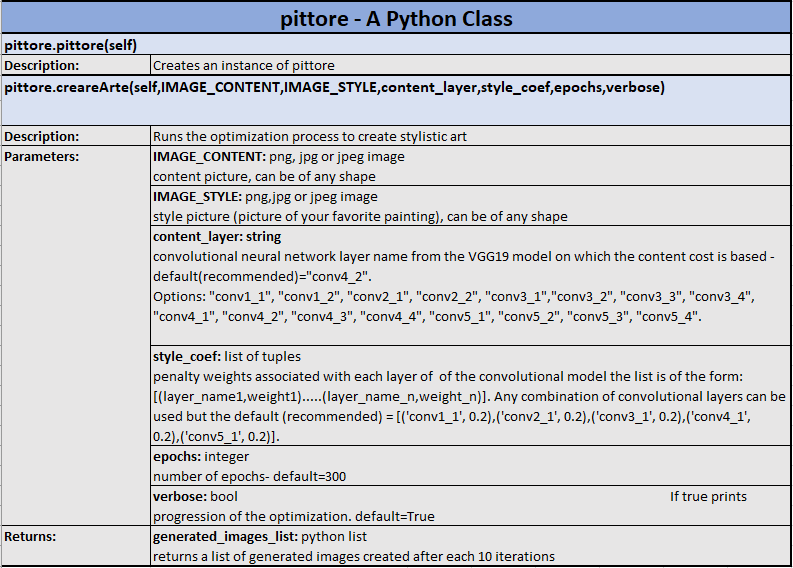
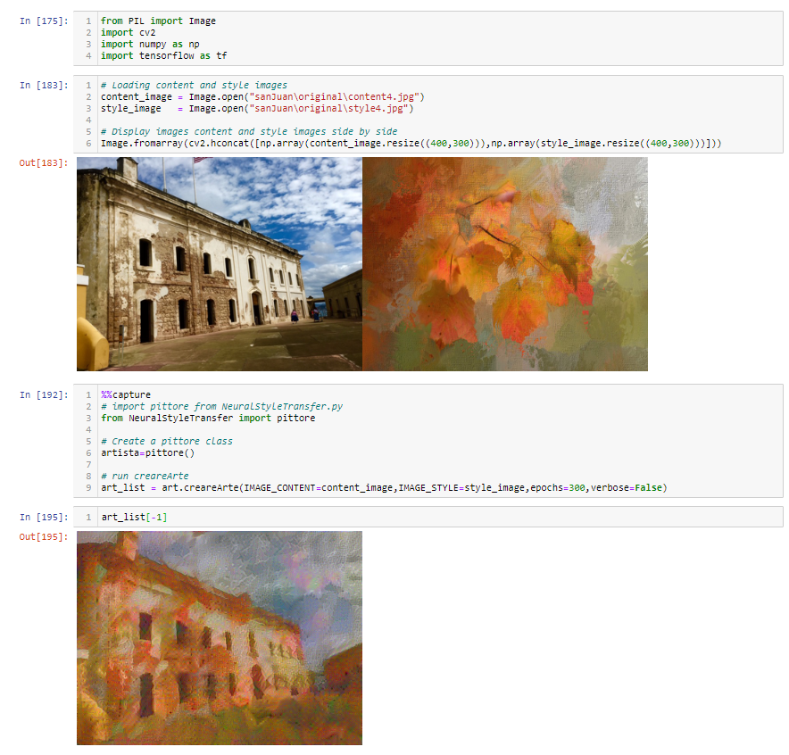
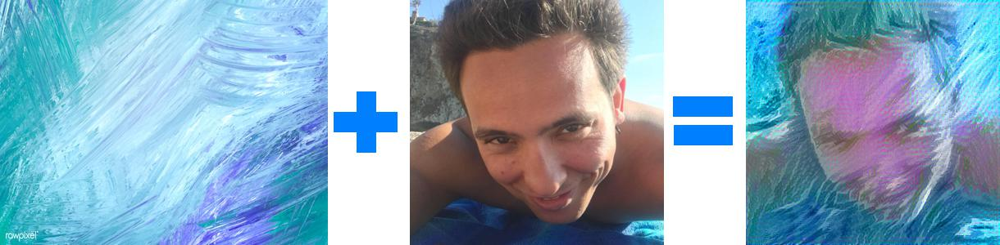

## Welcome to pittore

## Project Description
pittore turns your favorite pictures into stylistic art. It is open source, easy to use and rely on deep neural network technologies to create bespoke art. It works in 3 easy steps: 1) Load your content (Your favorite photo) and style (favorite painting) pictures, 2) create a pittore class object, 3) choose the styling papameters and run creareArte. 

This program is an implementation of a [journal article](https://arxiv.org/abs/1508.06576) titled: "A neural Algorithm of Artistic Style" by Leon A.Gatys, Alexander S.Ecker and Matthias Bethge. Some of the software material are due to MatCovnet and are subject to additional licensing rights. The pretrained VGG19 model parameters can be also downloaded at the following link: http://www.vlfeat.org/matconvnet/pretrained/.     

## Documentation
pittore is python class. Please refer to the documentation bellow:

## Example

## Additional Smples

