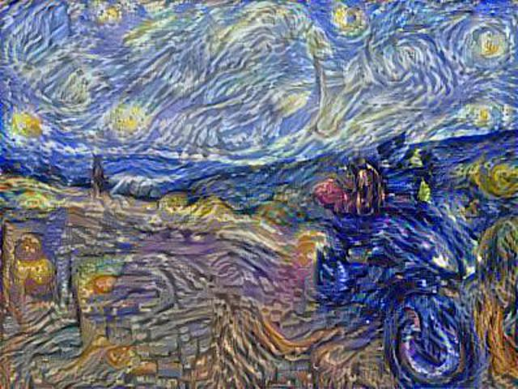

## Welcome to pittore



## Project Description
pittore turns your favorite pictures into stylistic art. It is open source, easy to use and rely on deep neural network technologies to create bespoke art. It works in 3 easy steps: 1) Load your content (Your favorite photo) and style (favorite painting) pictures, 2) create a pittore class object, 3) choose the styling papameters and run creareArte. 

This program is the implementation of a [journal article](https://arxiv.org/abs/1508.06576) titled: "A neural Algorithm of Artistic Style" by Leon A.Gatys, Alexander S.Ecker and Matthias Bethge. Some of the software material are due to MatCovnet and are subject to additional licensing rights. The pretrained VGG19 model parameters can be also downloaded at the following link: http://www.vlfeat.org/matconvnet/pretrained/.     


```markdown
Syntax highlighted code block

# Header 1
## Header 2
### Header 3

- Bulleted
- List

1. Numbered
2. List

**Bold** and _Italic_ and `Code` text

[Link](url) and 
```

For more details see [GitHub Flavored Markdown](https://guides.github.com/features/mastering-markdown/).

### Jekyll Themes

Your Pages site will use the layout and styles from the Jekyll theme you have selected in your [repository settings](https://github.com/SkanderSoltani/pittore.io/settings). The name of this theme is saved in the Jekyll `_config.yml` configuration file.

### Support or Contact

Having trouble with Pages? Check out our [documentation](https://help.github.com/categories/github-pages-basics/) or [contact support](https://github.com/contact) and we’ll help you sort it out.
